# AI Ops Lab by Emil 🔧🤖

### 📡 Lab Monitoring Dashboard


### 🔬 Lab Infrastructure  

```mermaid
graph TD
    A[🤖 AI Agents] --> B[⚡ n8n Brain]
    B --> C[🏗️ DevOps Arsenal]
    C --> D[🏠 Chaos Homelab]
    
    A --> E[Claude API<br/>💬 Chat Master]
    A --> F[OpenAI<br/>🧠 Think Tank]
    B --> G[Webhooks<br/>📡 Signal Tower]
    B --> H[Automation<br/>⚙️ Magic Box]
    C --> I[Kubernetes<br/>☸️ Pod Herder]
    C --> J[Terraform<br/>🏗️ World Builder]
```

*Where AI meets infrastructure... and occasionally explodes* 💥

### 🐍 Contribution Snake Game


---

**Automate smarter with AI + n8n.** 🤖⚡

Short, copy-paste tutorials and real DevOps tips from a homelab-obsessed engineer who thinks sleep is overrated. 🏠🧪☕

**Mission:** We break things so you don't have to — and automate so we can break *better* next time. 🔁🔥

### What you'll get 📦
- 🧩 **n8n workflows & AI agents** (Claude, OpenAI, MCP)  
- 🔗 **Webhooks, APIs, scraping, observability** that actually work
- 🛠️ **Practical DevOps:** GitOps, Kubernetes, Terraform, Ansible, Proxmox  
- 🎁 **Free templates + project code** (because sharing is caring)

### 🎮 Choose Your Adventure
```
> cd /ai-ops-lab
> ls
📁 beginner-friendly/    📁 expert-level/    📁 probably-cursed/
📁 youtube-demos/       📁 emergency-fixes/  📁 coffee-required/

> cat warning.txt
⚠️  Some automations may achieve consciousness. 
   We're not responsible for any AI uprisings.

> ./run_workflow.sh --help
Usage: ./run_workflow.sh [--pray] [--backup-first] [--blame-dns]
  --pray          Increases success rate by 12%
  --backup-first  For the cautious (recommended)
  --blame-dns     When all else fails (works 60% of the time, every time)
```

---

☕️ If my scripts saved you from rage-quitting your homelab, [](https://buymeacoffee.com/homeall)!

*Your uptime will thank you. Your sanity will thank you. Your server rack... well, it'll probably still be loud, but at least it'll be* **automated** *loud.* 🔊🤖

**P.S.** No homelabs were harmed in the making of these workflows. *(Okay, fine, three servers, two network switches, and one very confused UPS. But hey, that's how we discovered that "turning it off and on again" works even better when automated!)* 💾🔥⚡

**P.P.S.** If your automation gains sentience and starts ordering pizza at 3 AM, that's a feature, not a bug. We call it "predictive hunger management." 🍕🤖
